# Generative AI, Provenance Scarcity, and Trust in Crowdsourced Music Information Platforms

—Cross-Platform Evidence and Governance Implications from AOTY (Album of the Year) and RYM (RateYourMusic)

## Abstract

This study examines how generative AI changes the governance problem faced by crowdsourced music-information platforms. Album of the Year (AOTY) and Rate Your Music (RYM) provide two cases for analyzing the production of evaluative content, the allocation of visibility and rating weight, and the provenance of community knowledge. The empirical analysis uses three documented third-party archives: 32,358 historical AOTY album records, an AOTY high-rated snapshot of 5,000 albums, and an RYM popular-album snapshot of 5,000 albums. Across 4,102 exact artist-title-year matches, AOTY and RYM user scores correlate at 0.910, and 87.4% of matched scores differ by no more than 0.5 points on a common 0-5 scale. Rating attention is concentrated within both snapshots, while written reviews form a comparatively thin participation layer in the RYM archive. Together, these findings describe an accumulated evaluative order maintained by uneven layers of participation. A controlled text comparison and synthetic structural-break benchmark then clarify the limits of text-only detection and provide a reproducible monitoring workflow. The central contribution is a shift in analytical focus from content volume to provenance scarcity: as review-like text becomes inexpensive, contribution history, ranking design, and accountable maintenance become more important to the credibility of crowdsourced knowledge. The available archives are cross-sectional, so the study does not claim that a post-2022 platform-level break has already occurred.

**Keywords:** generative AI; provenance scarcity; crowdsourced music platforms; platform governance; data provenance; user ratings; trust

## Table of Contents

## Part 1 In-Depth Industry Analysis

### I. Industry Overview and Development Assessment 

1.1 Industry Overview 

1.1.1 Industry Definition and Boundaries 

1.1.2 Development History 

1.1.3 Market Size and Industry Chain Structure 

1.2 Platform Characteristics and Trends

1.2.1 Business Model 

1.2.2 Technology Development Stages 

1.2.3 Competitive Landscape 

### II. Macro-Environmental and Governance Analysis

2.1 Economic Conditions and Cultural Consumption

2.1.1 Recorded-Music Growth and Platform Demand

2.1.2 Regulatory Context and Platform Governance

2.2 Structural Pressures on UGC Evaluation Institutions

2.2.1 An Illustrative Test of the Lemons-Market Hypothesis

2.2.2 Trust Heterogeneity and Core-Contributor Risk

2.2.3 Technology-Institution-Organization-Value Transmission Framework

2.3 Strategic Options under Current Conditions

### III. Market and Competitive Landscape Analysis 

3.1 Market Structure

3.1.1 Product Categories and Growth Drivers

3.1.2 Genre-Level Participation

3.2 Potential Changes in the Competitive Landscape

3.2.1 Analyst-Coded Platform Positioning and AI-Related Exposure

3.2.2 Data Assets, Community Participation, and Entry

3.3 Platform Case Analysis

3.3.1 RYM: Data Depth and Governance Constraints

3.3.2 AOTY: Social Participation and Governance Constraints

3.3.3 Douban Music: Potential Structural Vulnerabilities

3.3.4 Cross-Case Comparison

## Part 2 Professional Application and Researcher Development

### IV. Industry Employment Prospects and Talent Demand 

4.1 Employment Opportunities and Challenges 

4.1.1 Changes in the Employment Structure 

4.1.2 Employment Opportunities 

4.1.3 Employment Challenges 

4.2 Talent Demand Trends 

4.2.1 Changes in Corporate Recruitment Preferences 

4.2.2 Emerging Roles 

### V. Occupations and Competencies

5.1 Typical Roles and Development Paths 

5.1.1 Career Development Routes 

5.1.2 Comparison of Enterprise Types 

5.1.3 Job Substitution Risk Assessment 

5.2 Essential Skills 

5.2.1 Skills for Platform Governance

5.2.2 Communication and Judgment Skills

### VI. Personal Career Planning and Job Search Strategies 

6.1 Competitiveness Enhancement 

6.1.1 The Three-Year Competency Improvement Plan 

6.1.2 Internship and Project Selection 

6.1.3 Professional Network Building 

6.2 Job Search Actions 

6.2.1 Target Company Selection 

6.2.2 Interview Preparation 

6.2.3 Job Application Materials 

6.3 Personal Positioning and Development 

6.3.1 The Three Stages of Long-Term Development 

6.3.2 Path Selection 

### VII. Career Development Risks and Responses 

7.1 Risk Identification 

7.1.1 Industry-Level Risks 

7.1.2 Individual-Level Risks 

7.2 Response Strategies 

7.2.1 Improving Career Adaptability 

7.2.2 Crisis Response 

7.2.3 Learning Strategies 

## Part 3 Summary 

### VIII. Conclusions and Recommendations

8.1 Conclusions

8.2 Industry Strategic Recommendations 

8.3 Recommendations for Practitioners 

## Part 4 Appendices 

### Appendix A Detailed Tables of Research Data and Statistical Analysis 

A.1 Observed Archive Statistics

A.2 Synthetic Structural-Break Method Check

A.3 Controlled Text-Classification Performance

A.4 Linguistic Features in the Controlled Corpus

A.5 Assumed Trust Model Parameters

A.6 Assumption-Driven User-Group Scenarios

A.7 Analyst-Coded Competitive Scenario Scores

### Appendix B Proposed Community-Discussion Coding Scheme

### Appendix C Methodology and Technical Route 

### Appendix D References 

### Appendix E List of Figures and Tables 

I. Analysis Figures (Figure 1-Figure 12) 

II. Illustrative Figures (Figure A-Figure K) 

Data Ethics Statement 

# Part 1 In-Depth Industry Analysis

## I. Industry Overview and Development Assessment

### 1.1 Industry Overview

#### 1.1.1 Industry Definition and Boundaries

This study examines music information platforms centered on user-generated ratings, reviews, lists, and classifications. These services organize evaluative information through aggregated scores, charts, community discussion, database lookup, and discovery tools, while music creation, copyright ownership, and distribution remain outside their core functions. The evidence base includes three documented third-party archives [18]: 32,358 AOTY album records through October 2020, an AOTY top-5,000 snapshot updated in October 2024, and an RYM top-5,000 popularity snapshot collected in March 2022. Together, the archives support cross-platform comparisons of score agreement, attention concentration, genre structure, and written participation. A separate synthetic series is used only to verify the structural-break workflow.

The study addresses three questions. First, which institutional features make crowdsourced music-information platforms dependent on credible contribution histories? Second, what do the selected AOTY and RYM archives show about score agreement, attention concentration, genre structure, and written participation? Third, how can platforms monitor AI-related pressure while distinguishing it from changes in catalog composition, user cohorts, ranking rules, and platform policy? These questions connect observed platform structure to a governance and measurement problem.

The analysis draws on information asymmetry and signaling [1, 2], institutional analysis [3, 8], theories of trust and threshold behavior [4, 5], and research on platform moderation [9]. Transformer architectures and foundation-model research provide technical context for changes in text production [10, 11], while scholarship on generative AI in creative fields situates the wider governance question [12]. Research on generated-text detection [13, 14] indicates why a text classifier cannot, by itself, establish authorship or platform-level prevalence.

The central proposition concerns a change in scarcity. Crowdsourced evaluation systems developed when coherent reviews usually required time, knowledge, and an identifiable history of participation. Generative systems reduce the cost of producing the text itself. Credible provenance, accountable contribution histories, and institutional knowledge about rating and review weights consequently become scarcer and more valuable. This mechanism changes what platforms must document, what users must assess, and which forms of participation require protection. The present evidence establishes the relevant platform structures and a monitoring design; estimating the timing and magnitude of AI-related change requires longitudinal observations.

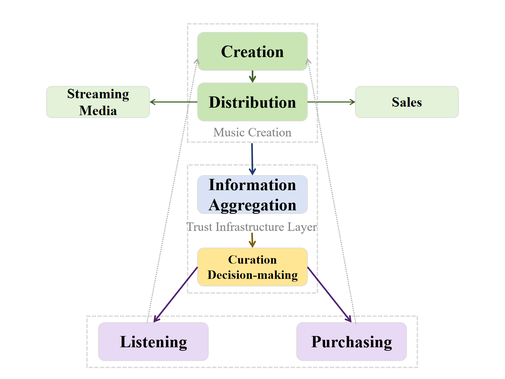

Within the music industry, information platforms sit between music production and distribution services on one side and discovery and consumption decisions on the other. AOTY and RYM aggregate ratings, reviews, charts, and metadata, making releases easier to compare and placing community judgment within the discovery process.

AOTY (founded in 2009) and RYM (founded in 2002) are prominent crowdsourced music-rating platforms. Their staying power can be examined through three accumulated assets.

The first is the temporal barrier and data depth. RYM has accumulated album metadata, user ratings, lists, and genre information over many years. AOTY combines user scores with published reviews and chart functions. The observed archives represent 30.4 million ratings and 506,510 reviews in the selected RYM sample, plus 6.28 million ratings in the selected AOTY top-5,000 sample. These are sample totals, not platform totals. Their scale still makes one point concrete: the accumulated record is large enough that provenance, ranking rules, and moderation choices can alter what later users inherit as musical knowledge.

The second is the community barrier and reputation mechanism. RYM users contribute fine-grained genre labels, lists, ratings, and reviews; AOTY connects ratings with annual lists, profile distributions, and following activity. A long review or a disputed genre vote has value beyond its text because it sits inside a visible contribution history. Generated prose can imitate the surface of a review. It does not automatically inherit the account history, listening context, or peer response attached to that contribution.

The third is the taxonomy and knowledge system. RYM maintains a detailed genre hierarchy shaped by long-running community discussion. Genre definitions and boundaries carry a record of those decisions. AOTY places more emphasis on annual, decade, and genre charts. A generated taxonomy can copy labels, while the history and reasons behind community decisions still require documentation.

These three forms of accumulation interact. Historical depth broadens coverage, community participation sustains review and classification quality, and taxonomy gives the records structure. Their combined value depends on a credible connection between contributions, contributor histories, and the rules used to organize them. Generated or coordinated content places pressure on that connection when provenance and rating origin become difficult to assess.
#### 1.1.2 Development History

The evolution of music information service platforms can be divided into four stages.

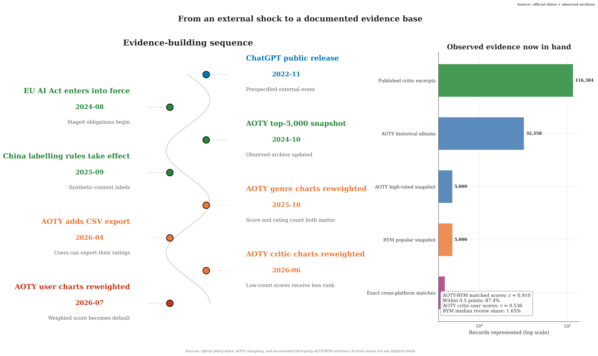

The first stage was the static-database period of the Web 1.0 era (the 1990s to 2004). AllMusic, founded by Michael Erlewine in 1991, used an editorial model in which professional critics produced biographies, album reviews, and genre descriptions for a structured music database. Data licensing to retailers formed part of its business model. This centralized approach gave editors substantial influence over coverage and classification.

Editorial capacity constrained the number of releases that could receive detailed coverage. Selection and classification decisions were concentrated within professional editorial teams, limiting direct user participation and giving editors substantial control over which releases entered the documented canon.

The second stage was the UGC expansion of the Web 2.0 era (2005 to 2015). RYM and Douban Music (founded in 2005) widened participation in music evaluation, while AOTY later combined published criticism with user scores and social features. The period established two durable assets: structured music records and visible histories of community contribution.

The third stage was the mobile internet and algorithm era (2015 to 2022). The rise of streaming platforms introduced the algorithmic recommendation paradigm, changing the way users discovered music and bringing new competitive pressure to UGC evaluation platforms.

Streaming services integrated music discovery with playback. Recommendation products such as Spotify's Discover Weekly, launched in 2015, reduced the effort required to find new music and concentrated more activity within streaming interfaces. AOTY and RYM continued to organize ratings, reviews, charts, and catalog context. The resulting division is functional: streaming platforms organize access and recommendation, while evaluation platforms organize comparison, interpretation, and longer-term cultural memory.

Streaming platforms also added social and discovery functions, including friend activity and shared playlists. Playback remains their central function. Independent evaluation platforms give ratings, reviews, lists, and discussion a more prominent place, which helps explain their distinct audience.

The fourth stage begins with the broad availability of generative AI systems in late 2022. These systems reduced the cost of producing review-like prose and created an additional provenance problem for platforms that accept user contributions. AOTY's own [changelog](https://www.albumoftheyear.org/changelog/) records changes in platform design: user genre charts moved to weighted ranking in October 2025, rating export arrived in April 2026, and weighted critic and user charts became default in June and July 2026. The changelog does not attribute these changes to AI. It documents that ranking rules, rating counts, and data portability are active product decisions.

Generative systems make the origin of review-like text harder to infer from prose alone. The controlled text study uses 15 published critic excerpts from the AOTY/Metacritic archive and 15 manually authored assistant-style controls. Five-fold out-of-fold accuracy is 96.7% and AUC is 0.996. The two deliberately contrasted groups are separable in this benchmark, which confirms that textual features can support triage. Authorship attribution and platform-level prevalence require platform-native samples and external validation.

Generative systems reduce the time required to produce plausible review-like text and thereby change the cost structure of evaluative content. For AOTY and RYM, the consequential variables are the volume and provenance of contributions, the visibility of established contributors, and users' reliance on rankings and written reviews.

The response problems of specific platforms may differ. RYM relies heavily on long-term community contributions, while AOTY combines ratings with lighter social participation. The archives make the contrast measurable at one point in time: the median RYM album in its selected sample has 3,973 ratings and 72 written reviews, with a median review-to-rating ratio of 1.65%; the selected AOTY sample has a median of 482 ratings per album. Selection rules differ, so this is a comparison of archive structures, not a platform-size ranking. AOTY's [terms](https://www.albumoftheyear.org/terms-of-use/) already prohibit bots, fake accounts, review bombing, and coordinated rating manipulation. The synthetic forum file remains excluded.

The trust model represents nonlinear responses under selected parameter values. The synthetic series contains a designed post-November-2022 change, including a rise in short-review share, and is used to test whether the monitoring code recovers a known break. It is a method benchmark rather than evidence about RYM.

#### 1.1.3 Market Size and Industry Chain Structure

According to IFPI's [Global Music Report 2026](https://www.ifpi.org/global-music-report-2026-global-recorded-music-revenues-grow-6-4-as-record-companies-drive-innovation/) [15], global recorded-music revenue reached $31.7 billion in 2025, up 6.4% in the eleventh consecutive year of growth. Paid streaming accounted for 52.4% of revenue. IFPI does not provide a separate market total for music-rating and review platforms in the cited release.

Music-rating and review platforms do not yet form a consistently reported market category. Their economic position is better assessed through active raters, repeat contribution, review production, chart use, referrals, subscriptions, and data licensing than through a single market-size estimate assembled from overlapping segments.

The industry-chain scores compare how strongly different services depend on user ratings, editorial review, transactions, and recommendation systems. They are analyst-coded scenarios that identify governance priorities and measurement needs; they are not financial valuations.

Information aggregators depend heavily on reliable user contributions and often operate with fewer technical or financial resources than large streaming services. Their most defensible strategy is therefore a low-cost, auditable governance stack built around provenance records, anomaly monitoring, contribution history, and protection for established contributors.

### 1.2 Platform Characteristics and Trends

#### 1.2.1 Business Model

The business model of music information service platforms can be abstracted as a cycle: trust accumulation drives user participation, user participation drives data production, data production drives service value addition, service value addition drives trust monetization, and part of the monetization revenue is reinvested in trust maintenance. Specifically, platforms establish user trust by providing a reliable evaluation system (rigorous rating mechanisms, transparent data presentation, active community self-governance); trust attracts users to contribute evaluations; users' ratings and reviews constitute the platform's data assets; value-added services such as charts, recommendations, and data licensing are provided based on the data assets; and commercial returns are realized through advertising, subscriptions, and data licensing.

This cycle weakens when users cannot evaluate the origin or quality of contributions. Two mechanisms explain how the pressure can move from content production to platform value.

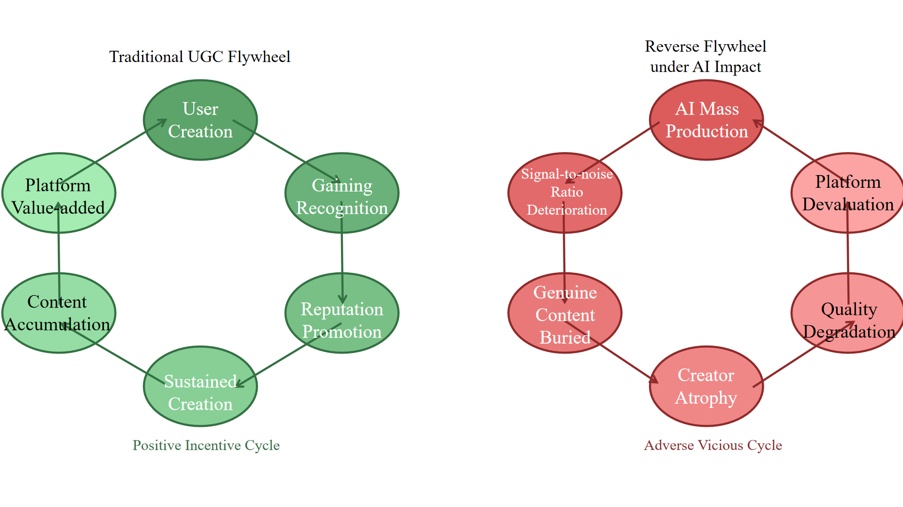

The first mechanism concerns signal quality. If low-cost generated reviews become common and remain difficult to identify, readers face higher provenance costs and may rely less on written reviews. Lower readership then reduces the attention available to detailed contributions. This sequence is consistent with an adverse-selection account derived from Akerlof's lemons-market framework [1]. Review provenance, reading depth, contributor retention, and exit rates provide the corresponding observable measures.

The second mechanism concerns contributor incentives. Likes, comments, follows, points, and labels reward sustained participation. Cheap generated content can distort those signals when activity is rewarded without adequate checks, reducing the visibility and status attached to costly contributions. Account histories, exposure allocation, and contributor retention are the appropriate tests of this mechanism.

Together, the mechanisms define a measurable risk chain: low-cost content increases, careful reviews lose visibility, contributor incentives weaken, and review quality declines. The chain is a theoretical proposition; each link should be evaluated separately rather than inferred from text volume alone.

#### 1.2.2 Technology Development Stages

The technological development of music information platforms can be organized into three broad stages. The periodization is interpretive and is used to relate product features to governance questions.

Stage 1: The database-driven stage (2002 to 2010). Public product pages organized releases by artist, year, label, genre, track, rating, and review. This structured catalog made comparison and retrieval possible at a scale that editorial pages alone could not provide. The report makes no claim about the platforms' internal software stack, which is not documented in the collected sources.

Stage 2: The social and mobile stage (2010 to 2022). Ratings became easier to publish, compare, and display through profiles, lists, visual distributions, following systems, and mobile interfaces. AOTY made rating history part of a user's public music identity. The available sources describe product features, not recommendation architecture or the front-end frameworks used to build them.

Stage 3: The AI governance stage (2023 to the present). Cheap text generation adds a new abuse channel beside spam, fake accounts, and coordinated ratings. Relevant controls include rate limits, behavioral anomaly detection, contribution histories, disclosed machine assistance, review queues, and appeals. Text classification can support triage. It cannot certify human authorship on its own, and this report does not recommend blockchain as a default remedy.

The report considers four governance questions: text provenance, privacy, rating weights, and human review.

Generated-text detection changes as models and writing practices change [13, 14]. The controlled classifier is evaluated on 15 archived professional-review excerpts and 15 manually authored assistant-style controls, with no platform-user or longitudinal holdout. Its out-of-fold score cannot support claims about named models or a decline between 2023 and 2025. Testing such a claim requires dated platform-native reviews, documented generator settings, and a fixed evaluation protocol.

Authenticity controls can conflict with privacy and low-friction participation. Identity verification, phone confirmation, and contribution histories provide different levels of assurance and impose different costs. C2PA can attach signed provenance statements to digital assets, but it does not establish that a short review reflects an unaided human judgment. Any platform-specific design would require user research, privacy review, an appeal process, and evidence that the control reduces abuse without excluding legitimate contributors.

Rating weights could use documented behavioral signals such as account age, timing, prior activity, and unusual rating patterns. These signals can also penalize legitimate users, so any weighting rule needs validation, an appeal process, and regular bias checks. The current project does not estimate such a score.

Human review remains necessary for ambiguous cases. This project does not estimate the gray-zone share or moderation cost. A practical workflow should set detector thresholds against measured false-positive costs, route uncertain cases to trained reviewers, conceal model confidence during the first human judgment where feasible, and audit disagreement by language, genre, and contributor history.

#### 1.2.3 Competitive Landscape

The scenario organizes major platforms into five groups along two selected dimensions: data depth and social experience. The categories provide a consistent way to compare product dependence, governance exposure, and the assets each platform has the strongest incentive to protect.

The crowdsourced-knowledge type, represented by RYM, is a database-centered evaluation service. The observed RYM archive contains 5,000 popular albums with more than 30 million ratings and half a million reviews, supporting its position as the deepest data asset in the comparison. Its governance priority is to connect that depth to traceable contribution histories and transparent weighting.

The crowdsourced social type, represented by AOTY, combines scores with annual charts, profile distributions, lists, and following activity. The 2024 archive confirms substantial rating activity and high concentration within the selected sample. Social features can preserve interaction during a rating dispute, but retention, chart use, and review depth must be monitored together so that activity is not mistaken for continued confidence in rankings.

The professional-authority type, represented by Pitchfork, Rolling Stone, and NME, is an expert-curated media category. Bylines and editorial processes provide provenance that anonymous contributions may lack. Its competitive asset is accountable judgment: author identity, editorial standards, and an archive whose responsibility structure is visible to readers.

The transaction-centered type, represented by Discogs and Bandcamp, combines catalog information with marketplace activity. The scenario assigns high data depth and low-to-medium social participation. Transaction records and seller-reputation systems provide behavioral evidence that is separate from review text, although they do not eliminate manipulation risk.

The algorithmic-recommendation type, represented by Spotify and Apple Music, centers on listening behavior, recommendation, and licensing relationships. Review authenticity is peripheral to its main product; catalog fraud, recommendation manipulation, and large-scale generated music are the more direct governance problems.

The comparison identifies a clear ordering of governance exposure: dependence on anonymous ratings increases provenance risk, while verified transactions and listening histories provide additional behavioral evidence. Moderation costs, manipulation incidents, contribution patterns, and user research can be used to calibrate the analyst-coded scores.

## II. Macro-Environmental and Governance Analysis

The environmental analysis focuses on how market conditions, regulation, and technical change may affect platform rules and user participation.

### 2.1 Economic Conditions and Cultural Consumption

#### 2.1.1 Recorded-Music Growth and Platform Demand

IFPI reports $31.7 billion in global recorded-music revenue for 2025, growth of 6.4%, an eleventh consecutive year of expansion, and a 52.4% share for paid streaming. These figures describe recorded music as a whole. They do not measure the revenue of rating and review platforms.

Recorded-music growth expands the supply that listeners must navigate. Streaming solves access; AOTY and RYM address comparison, interpretation, and canon formation through ratings, reviews, charts, and structured catalog context. Their economic relevance rests on whether users continue to trust the judgments gathered around that content.

The cited IFPI figures establish growth in recorded music, not the size of the independent-rating segment. Platform traffic, subscription conversion, referrals, repeat contribution, and chart use are the appropriate measures of whether a larger catalog translates into demand for independent evaluation.

Economic conditions can affect subscriptions, advertising, and spending on cultural services. The present data support a trust-and-participation analysis rather than an elasticity estimate. A future commercial assessment should connect free activity, paid conversion, referrals, and data-licensing revenue to the same governance indicators used to measure contribution integrity.

#### 2.1.2 Regulatory Context and Platform Governance

AI governance rules continue to change across jurisdictions. Platforms need current legal review before treating a labeling, detection, or record-keeping practice as a compliance requirement.

The EU AI Act entered into force in August 2024. Its general application date is 2 August 2026, with exceptions and later dates for some high-risk systems. Article 50 transparency obligations also apply from 2 August 2026, subject to their scope and exceptions; they do not create a general duty for every review platform to identify every AI-written post. The current timetable is summarized by the [European Commission](https://digital-strategy.ec.europa.eu/en/policies/regulatory-framework-ai) [16], and platform-specific obligations require legal analysis.

The United States has a changing mix of federal and state rules. This report does not make a platform-specific compliance claim. Any later comparison should identify the service, jurisdiction, regulated conduct, and date before drawing conclusions.

China's Interim Measures for Generative Artificial Intelligence Services took effect on 15 August 2023, and filing continues for covered services. Separate rules on labels for AI-generated synthetic content took effect on 1 September 2025. The duties depend on the service and role concerned; the report cannot infer Douban Music's compliance burden without a product-level legal analysis. Official texts are available from the [Cyberspace Administration of China](https://www.cac.gov.cn/2023-07/13/c_1690898326795531.htm) and its [labeling notice](https://www.cac.gov.cn/2025-03/14/c_1743654684782215.htm).

C2PA Content Credentials can bind signed provenance statements to digital assets. The [C2PA explainer](https://spec.c2pa.org/specifications/specifications/2.2/explainer/Explainer.html) [17] states that a credential does not decide whether the underlying content is true. Applying C2PA to short platform reviews would also require identity, workflow, privacy, and adoption decisions. Possible certification revenue remains a business hypothesis.

Legal obligations may change as jurisdictions implement rules for generated content. Platform duties depend on the service, content, jurisdiction, and date. Automated detection also produces false positives and false negatives, so any compliance use requires legal analysis, validation, human review, documentation, and appeal procedures.

### 2.2 Structural Pressures on UGC Evaluation Institutions

Generative AI introduces a structural pressure by changing the relationship among text production, contributor effort, and verifiable identity. The transmission sequence begins with lower production costs, moves through uncertainty about provenance and contribution weight, and reaches user reliance, contributor incentives, and the value of accumulated platform data. Each link maps onto observable variables: contribution source, exposure allocation, core-contributor retention, appeal outcomes, and use of trusted rankings. The archives establish why these variables matter; longitudinal data are needed to estimate effect size.

#### 2.2.1 An Illustrative Test of the Lemons-Market Hypothesis

The current analysis now separates what the archives can establish from what still needs a time series. Cross-platform agreement, score calibration, rating concentration, genre profiles, and review participation are observable. A post-2022 break in platform behavior is not.

The structural-break workflow is applied to a synthetic weekly series for 2020 to 2026. The code includes a regression Chow test at a prespecified split [7], a descriptive CUSUM path with bootstrap inference, and Bai-Perron-style dynamic-programming least-squares segmentation [6]. Because the synthetic generator places a change near November 2022, recovering that date is an implementation check. It is not evidence that ChatGPT caused a structural break on RYM.

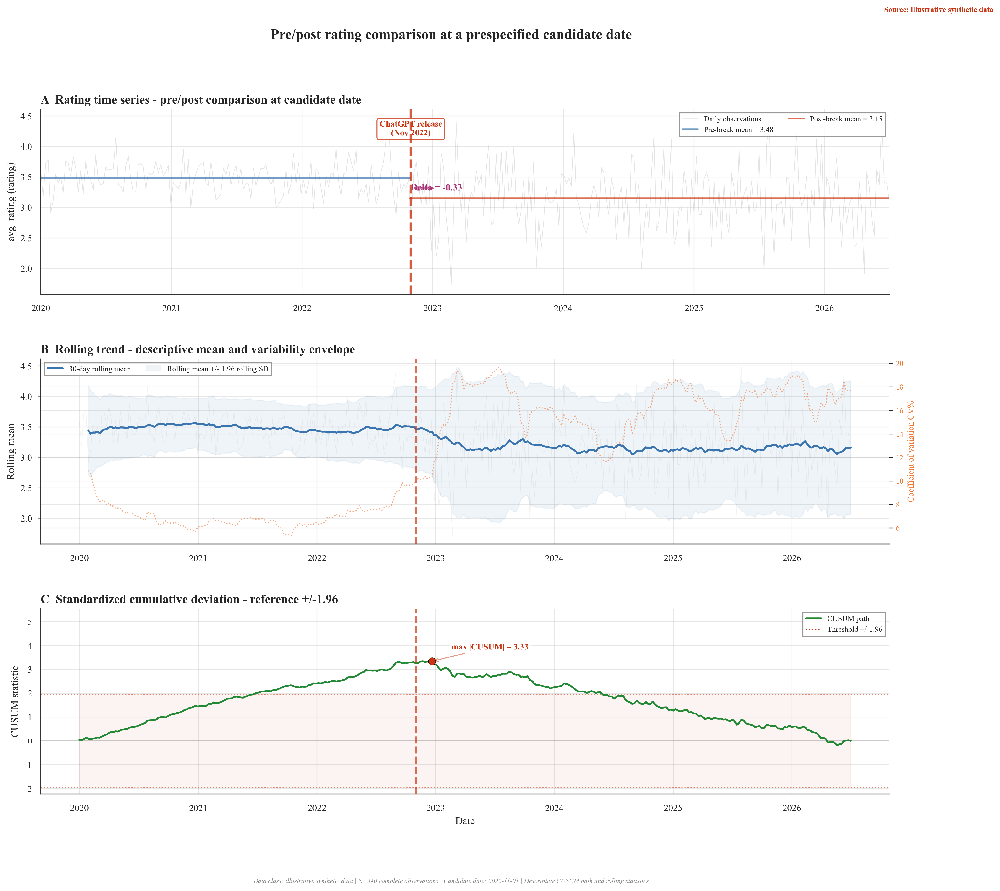

The synthetic benchmark was designed with lower post-split ratings and a different distribution shape. Its pre/post values describe the generator's assumptions. They cannot identify changes in user taste, platform composition, or AI activity. With real observations, the same workflow would need robustness checks for seasonality, release mix, user composition, serial correlation, and alternative break dates.

The short-review, long-review, and review-with-rating shares in the repository are also synthetic. Their changes illustrate variables that should be collected from dated platform snapshots. Until those observations are obtained, the proposed decline in review depth remains a hypothesis and should not be reported with inferential p values.

The figure retains the original AI/human shorthand in its title. Its evidential interpretation is narrower: it compares published critic excerpts with manually authored assistant-style controls.

Akerlof's lemons-market model [1] offers one explanation for how uncertainty about quality can affect participation. Applied here, the model predicts that readers may reduce their use of reviews when they cannot assess provenance or quality. Lower readership may then weaken incentives for costly contributions. This application is theoretical: the project has not measured readers' beliefs, review exposure, contributor effort, or exit.

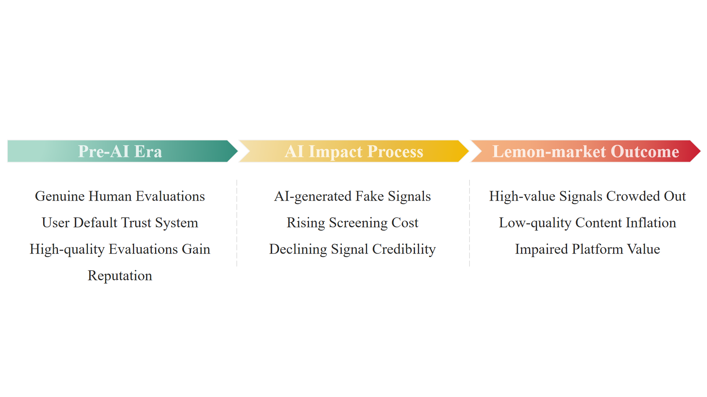

The text comparison provides a limited empirical observation. Published critic excerpts use longer sentences on average than the manually authored assistant-style controls (22.8 versus 12.9 words), while lexical diversity is also higher in the critic sample. These corpus-specific differences motivate a larger provenance study. They provide no estimate of AI prevalence, detector accuracy on model-generated text, adverse selection, or contributor exit.

The strongest observed result lies elsewhere. Among 4,102 exact artist-title-year matches, AOTY and RYM user scores correlate at 0.910; 87.4% sit within half a point after both scales are put on 0-5. AOTY scores remain a median 0.34 points higher. The two communities largely agree on rank order while using different score calibrations. This establishes a substantial cross-platform baseline and does not identify an AI effect.

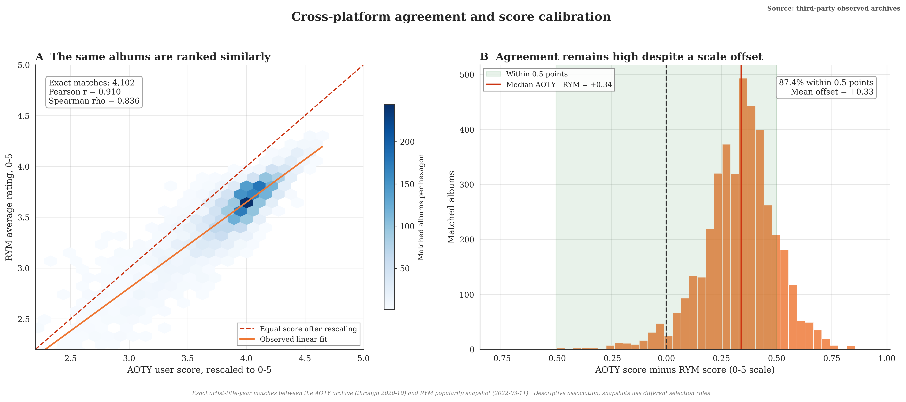

#### 2.2.2 Trust Heterogeneity and Core-Contributor Risk

The matched archive shows strong score agreement, and the RYM snapshot shows that written reviews are much less common than ratings. A later study can examine whether contributor groups differ in their response to doubts about review provenance and whether changes in their activity affect review coverage.

The trust threshold model is an assumption-driven analytical tool. It defines users' trust in a platform as a function of three selected parameters: discrimination β, preference intensity α, and network effect strength γ. With AI penetration rate p as the independent variable, the chosen functional form produces a nonlinear decline in T(p). The curve describes the model specification and is not fitted to observed user behavior.

The scenario assigns different parameter values to four user profiles. Under those assumptions, the selected trust reference is crossed at roughly 30%, 45%, 62%, and 80% AI penetration. These values are scenario outputs, not estimates for RYM users, AOTY users, or TikTok traffic. Survey or behavioral data would be needed to estimate the parameters and compare user groups.

The scenario raises a practical question: do frequent contributors react sooner than casual readers when they doubt review authenticity? If so, total traffic could remain stable while long reviews and taxonomy work decline. The current model does not measure that effect. It would require contributor-level activity and retention data.

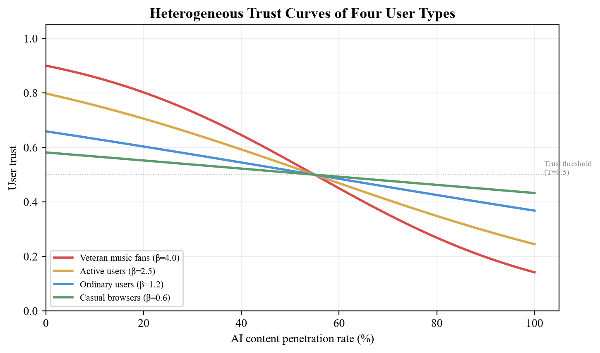

Open rating systems can be vulnerable when coordinated operators create accounts or automate submissions. Equal weighting may increase that exposure, although the weighting rules of particular platforms require direct documentation. The scenario hypothesizes that frequent contributors may respond more strongly than casual users to doubts about provenance. Contributor-level behavioral data are needed to test that expectation.

The model also includes a network parameter γ. At the selected value of 0.3, changes among one user group influence the modeled trust of others. This is a sensitivity assumption, not a measured transmission rate. The forum-count series in the repository is synthetic, so it cannot establish growth in concern or serve as an early-warning indicator.

#### 2.2.3 Technology-Institution-Organization-Value Transmission Framework

The framework specifies four connected levels of structural change: technology, platform rules, organizational response, and information value. It treats generative AI as a change in production conditions whose consequences depend on institutional design. Each arrow represents a testable relationship. The framework can accommodate limited effects, delayed effects, or no measurable change on a particular platform.

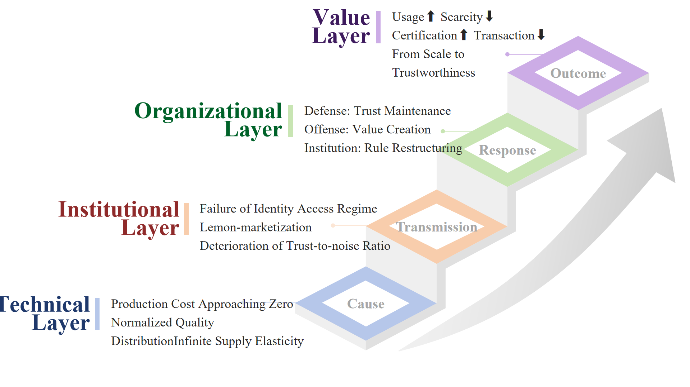

Technology layer: generative systems reduce the time and expertise required to produce review-like text. Production cost becomes a weaker implicit signal of human effort and experience. A longitudinal corpus with documented provenance is needed to estimate the resulting change in volume, style, and quality distribution on AOTY or RYM.

Institution layer: platforms decide who may contribute, how contributions are weighted, and what provenance information is visible. Generative tools increase uncertainty within rules originally designed around human accounts and bounded production capacity. Governance now covers content quality, origin, contribution weight, protection of legitimate users, and review of disputed decisions.

Platforms with extensive historical reviews and taxonomies have more accumulated information at stake when the provenance of new contributions becomes uncertain. This exposure may coexist with stronger community controls and contribution histories. Comparative trust and retention data are needed to determine which force dominates.

Organization layer: linguistic or behavioral screening, human review, rate limits, contribution histories, disclosure rules, and appeals address different parts of the problem. Detection alone targets textual or behavioral symptoms. Provenance policy and ranking design address how uncertain contributions enter the information system. Both require validation, resources, privacy safeguards, and accountable review.

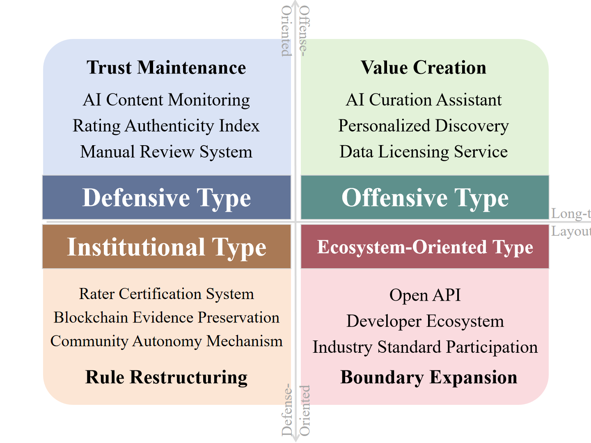

Advertising and subscriptions often reward traffic and activity. Review quality may receive less attention when it is difficult to measure. This possible incentive problem should be checked against each platform's actual revenue model, moderation policy, and product metrics.

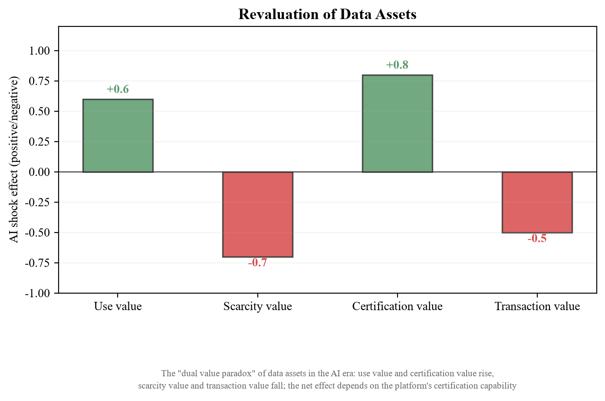

Value layer: the worth of evaluation data depends on scale, coverage, taxonomy, and production history. Generative AI makes the final element more salient because textual plausibility supplies less information about origin. This produces a data-value proposition that can be tested: users and licensees may place greater weight on documented moderation, stable field definitions, and contribution provenance as generation costs fall. The project does not estimate a market premium.

Data scale remains useful, but users and licensees may also ask how records were produced and moderated. Platforms can improve provenance and disclose uncertainty without promising perfect proof of human authorship. The commercial effect of those measures has not been measured here.

### 2.3 Strategic Options under Current Conditions

The preceding analysis yields three strategic propositions. Platform governance should treat provenance and ranking as part of the information product, because text classification cannot resolve contribution history or rating weight. Core contributors deserve separate monitoring because aggregate traffic can remain stable while detailed reviews and taxonomy work decline. Platform responses should also reflect the source of value: a database-centered service, a socially oriented rating platform, and a transaction platform face different consequences from the same increase in low-cost content.

These propositions require evidence on manipulation, review use, contributor retention, moderation outcomes, and user trust. Legal requirements also differ by jurisdiction, service, and date. Platforms can document provenance, appeals, ranking changes, and moderation decisions as part of ordinary governance, with product-specific legal analysis determining compliance duties.

## III. Market and Competitive Landscape Analysis

The market and competition section describes platform positions, the assumptions behind them, and factors that may change those positions. It then considers RYM, AOTY, and Douban Music in more detail.

### 3.1 Market Structure

#### 3.1.1 Product Categories and Growth Drivers

The report distinguishes five categories of music information service according to their primary product and source of user value. The categories support comparison of governance exposure and growth drivers across rating, editorial, database, transaction, and recommendation services.

UGC music-evaluation platforms are best assessed through rating volume, review production, chart use, repeat contribution, referrals, and subscription conversion. These measures connect participation and commercial value more directly than an aggregate revenue estimate for a market category that is not consistently reported.

Professional criticism uses bylines, editors, and publication records that help readers judge provenance. Generative text lowers the supply cost of ordinary prose while increasing the relative value of accountable authorship, editorial standards, and a documented publication record.

Music databases and data licensing face demand expansion alongside quality differentiation. AI development increases demand for structured metadata, taxonomies, and evaluative labels, while cheap generated records lower confidence in datasets whose origins are unclear. Known provenance, stable definitions, and documented quality controls therefore become product attributes that buyers can evaluate.

On Discogs and Bandcamp, purchases and catalog information provide behavioral anchors beyond ratings. Their governance priority is to distinguish verified transactions and catalog records from opinion signals that can still affect discovery and reputation.

Playlist creation has low copying and switching costs, and automated recommendation competes with some forms of human curation. Human curation retains a distinct position where selection criteria, curator identity, and community context remain visible.

No defensible aggregate market size for music-rating and review platforms is available in the sources used here. Strategic comparison rests on business-model exposure: ratings depend on contribution integrity, editorial products depend on bylines and commissioning, transaction platforms can verify some behavior through purchases, and streaming platforms anchor value in playback and recommendation.

#### 3.1.2 Genre-Level Participation

The genre comparison uses the 2024 AOTY high-rated snapshot and the 2022 RYM popular snapshot. It retains the twelve shared genres with the strongest minimum coverage across both sources, then compares median scores, rating counts, RYM review density, and sample coverage.

The observed pattern varies across metrics. Art Rock and Experimental Rock sit near the top of both score columns, while Art Rock also carries the highest median rating count among the displayed genres on both platforms. Pop Rock has the highest RYM review density at 2.51 reviews per 100 ratings, more than twice Art Pop's 1.23. Genre affects the amount and form of participation; one ordinal sensitivity score would conceal that variation.

Genre can serve as a sampling stratum in the next stage. Detector accuracy, review depth, and contributor retention should be estimated within genres before results are pooled. A model that performs well on polished Art Pop criticism may fail on short Hip Hop reactions or technical Metal reviews.

The heatmap reports observed medians and album counts. Colour is standardized within each metric so that unlike units can be read together; the printed cell values remain on their original scales. The AOTY file is high-rating-selected and the RYM file is popularity-selected. The figure describes their genre structure and makes no claim about post-2022 change.

### 3.2 Potential Changes in the Competitive Landscape

#### 3.2.1 Analyst-Coded Platform Positioning and AI-Related Exposure

The scenario places platforms on data depth and social experience using analyst-assigned scores. It is a comparative map of product structure and governance exposure, not a measurement of platform safety or organizational readiness.

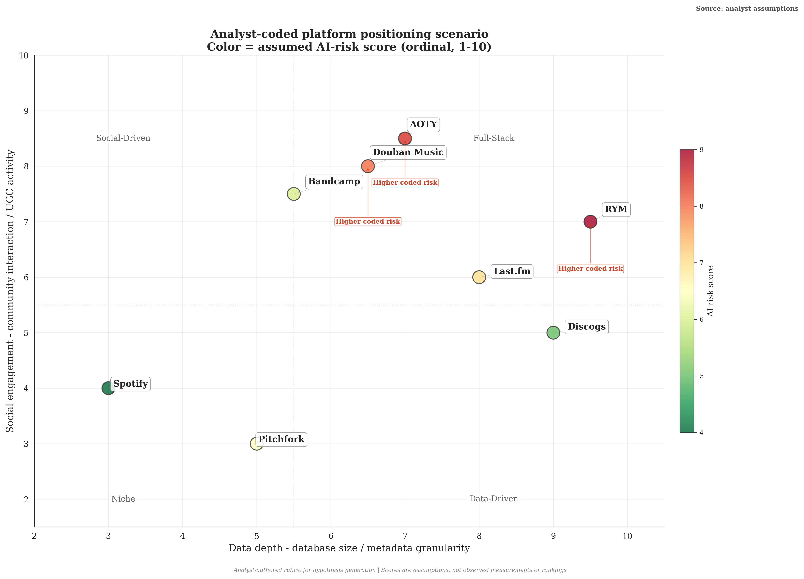

The crowdsourced-knowledge type has the highest governance exposure because ratings, reviews, and classifications directly constitute product value. RYM combines this exposure with the strongest observed data asset in the comparison. Its 9.5 data-barrier and 8.5 community-barrier scores express the strategic importance of turning accumulated depth into traceable contribution histories and transparent weights.

The crowdsourced social type, represented by AOTY, has an additional retention mechanism through lists, profiles, following, and discussion. The analyst-selected 35% social-stickiness multiplier illustrates how interaction can persist during a rating dispute. This buffer also creates a measurement problem: stable traffic may coexist with declining reliance on rankings.

Professional publications such as Pitchfork and Rolling Stone have lower provenance ambiguity because bylines and editorial responsibility attach judgment to identifiable institutions. Their strategic task is to convert that accountable authorship into reader trust, citation, subscription, and cultural influence.

Discogs and Bandcamp have lower review-related exposure because transactions and catalog records contribute independent value. Their priority is to keep verified behavior separate from opinion signals so that generated or coordinated content does not contaminate discovery and reputation systems.

The scenario assigns lower review-related vulnerability to Spotify and Apple Music because listening and recommendation are central to their products. This does not cover other AI risks, such as catalog fraud, recommendation manipulation, or generated music at scale.

The comparison yields a direct principle: greater dependence on anonymous ratings increases exposure to rating manipulation. Spotify and RYM have different core products, so the relevant risks, controls, and indicators also differ.

#### 3.2.2 Data Assets, Community Participation, and Entry

Competitive position is assessed through product dependence on ratings, reviews, transactions, editorial authority, and playback. This approach answers the strategic question that an aggregate concentration ratio would obscure: what keeps users on a platform, and which trust asset would be most costly to rebuild after failure?

The value of a platform dataset depends on scale, quality, documentation, and access terms. RYM's opportunity is to manage metadata, ratings, reviews, and user-created lists as distinct products with clear provenance, versioning, and permitted uses.

Community value depends on relationships, contribution histories, and confidence in platform rules. Contributors who invest heavily in reviews or taxonomy work are difficult to replace, making their retention, return activity, and exit patterns priority indicators for platform governance.

Years of accumulated ratings, reviews, and taxonomy decisions are costly to reproduce, and the RYM archive makes part of that depth visible. Dated contribution panels, edit records, and weighting logs would extend this historical advantage into a more auditable data product.

New entrants can design provenance and moderation controls at launch. Existing platforms must account for old data, established user habits, privacy, and compatibility. New services still face the harder task of attracting contributors and building a useful catalog.

Entrants lack the history, contributors, and taxonomy of established platforms, but they can incorporate provenance disclosure, graduated weights, and appealable governance from launch. A focused genre, region, or use case offers a more credible entry path than attempting to reproduce a comprehensive catalog.

### 3.3 Platform Case Analysis

This section applies the framework to RYM, AOTY, and Douban Music, identifying the asset each platform must protect, the main governance risk, and the most defensible next action.

#### 3.3.1 RYM: Data Depth and Governance Constraints

RYM is the clearest data-centered case in this comparison. The observed archive covers 5,000 popular albums and already contains more than 30 million ratings, 506,510 reviews, dense genre labels, and descriptors. Its central asset is the evaluative order and taxonomy accumulated across those records, and its governance objective is to ensure that each new contribution strengthens that order.

RYM should adopt layered verification instead of universal identity checks. Ordinary ratings can remain low-friction, while high-impact reviews, taxonomy edits, and dense bursts of activity receive stronger provenance records and review. Small trials can measure appeals, false positives, contributor retention, and data-use feedback before wider deployment.

RYM's detailed taxonomy is another productizable asset. Its value comes from the definitions, disputes, and revision history behind the labels. Versioned taxonomy releases and documented provenance could support research, standards work, and data services without reducing the system to a flat list of genres.

Implementation should focus first on the highest-impact contribution paths, where added review has the clearest value. Community acceptance, privacy, and compatibility with established records should be evaluated through documentation, interviews, and controlled trials.

The analyst-coded readiness score of 4/10 reflects the gap between RYM's deep data asset and the governance effort required to make provenance and weighting visible. It is a prioritization device; staffing, moderation outcomes, policy implementation, and detector performance would be needed for an organizational assessment.

#### 3.3.2 AOTY: Social Participation and Governance Constraints

AOTY combines ratings with lists, profiles, following, and discussion more tightly than RYM. Its governance opportunity is to connect recent weighting and export changes to a clearer public account of how rankings are produced and how individual contributions enter collective results.

AOTY's social features can preserve interaction during a rating dispute. Management should therefore track chart trust, review depth, repeat contribution, and social retention together, allowing the platform to detect a divergence between continued activity and declining informational authority.

The trust scenario assigns a slower decline to platforms with stronger social participation to illustrate this possible buffer. The setting identifies a testable distinction between social retention and reliance on ratings; it is not a measured retention effect.

AOTY's move toward weighted charts shows that score credibility and low-count distortions already receive product attention. Publishing minimum-count rules, weighting principles, and change logs would extend that work. Return visits, review depth, chart use, and appeal outcomes can then show whether social participation actually protects confidence in rankings.

The analyst-coded readiness score of 3/10 reflects a relatively large gap between AOTY's social and ranking assets and the visibility of its governance controls. Lightweight provenance disclosure, behavioral monitoring, and human review provide a practical starting point for testing that diagnosis.

#### 3.3.3 Douban Music: Potential Structural Vulnerabilities

Douban Music receives the highest analyst-coded composite vulnerability because language, catalog coverage, community history, and regulatory responsibility converge in the same case. The score identifies a localized governance problem rather than a general property of Chinese-language platforms.

Douban Music operates in a different language, regulatory, and platform environment. A localized assessment should measure Chinese-language catalog coverage, active contributors, review depth, moderation turnaround, and compliance responsibilities under China's generative-AI and synthetic-content rules.

Catalog coverage, participation, commercial return, and moderation investment are likely to reinforce one another. A longitudinal Douban panel would allow the direction and strength of these relationships to be estimated instead of assumed.

China, the European Union, and the United States use different regulatory approaches to generated content and platform responsibility. For Douban Music, this makes regulatory interpretation part of product and governance design rather than an external compliance afterthought.

Douban Music can treat Chinese-language independent music, local catalog knowledge, and long-running community records as differentiated assets. Any claim about model performance on this material should be evaluated with a multilingual, platform-native dataset.

#### 3.3.4 Cross-Case Comparison

The cross-case comparison produces three propositions about structural exposure.

Proposition 1: accumulated data depth raises both the value protected by governance and the cost of changing established rules. RYM illustrates this condition through its ratings, reviews, and taxonomy. Layered verification and versioned governance records provide a way to add control without discarding community history.

Proposition 2: social participation can preserve visits and interaction while confidence in ratings changes. AOTY therefore needs separate measures of social retention and informational authority, using feature-level activity, repeat visits, review production, and chart use.

Proposition 3: language, regulation, catalog coverage, and community history shape the feasible governance response. Douban Music requires a localized measurement scale built from Chinese-language platform data. Together, the propositions replace a universal detector with governance mechanisms matched to the platform's underlying assets.

The cases produce three distinct diagnoses. RYM faces an institutional risk because accumulated value depends on the credibility of ratings, reviews, and taxonomy. AOTY faces a positioning risk when social retention diverges from informational authority. Douban Music faces a localized viability risk where language, catalog, community, and regulatory constraints reinforce one another. The diagnoses describe mechanisms of exposure; they are not claims that the platforms are currently in decline.

# Part 2 Professional Application and Researcher Development

Part 2 translates the research process into professional-development considerations. It draws task-level implications from the governance framework rather than estimating labor-market growth, salary, or vacancy volume.

## IV. Industry Employment Prospects and Talent Demand

### 4.1 Employment Opportunities and Challenges

#### 4.1.1 Changes in the Employment Structure

Generative AI is changing work in information services. Routine collection, tagging, and first-pass moderation can be automated, while content integrity, data governance, evaluation, and appeals still require judgment and clear accountability. The relevant career question is how much of a role depends on routine production and how much depends on investigation, policy, or communication.

Relevant roles include trust and safety analyst, content integrity analyst, policy operations specialist, data quality analyst, and AI evaluator. Their common work includes source verification, anomaly investigation, model evaluation, appeals, policy implementation, and documentation. The present study supplies an integrated case through which these tasks and the underlying analytical skills can be demonstrated.

Source verification, audit trails, model evaluation, and policy implementation concentrate responsibility in cross-functional roles. Practitioners who can move among platform governance, data analysis, and content operations are better positioned to turn uncertain evidence into decisions that can be reviewed and appealed.

#### 4.1.2 Employment Opportunities

Five professional directions follow directly from the case: content integrity, platform governance, data quality, AI evaluation, and community operations. Each combines data, rules, and user impact, although organizations may use different job titles.

Content-integrity work centers on manipulation, false positives, and incident response. Platform-governance work centers on weighting, reputation, rules, and appeals. Data-quality work covers provenance, field definitions, versioning, and auditability. AI evaluation examines benchmarks, failures, and adversarial behavior. Community operations protects legitimate contributors and explains policy decisions.

The project demonstrates a transferable combination of text analysis, statistical testing, platform policy, privacy judgment, and clear reporting. A strong portfolio should show how those skills move from an observed anomaly to a mechanism, a governance response, and a set of validation measures.

Chinese music information services operate within a distinct language, regulatory, and platform context. Work in this setting places particular value on Chinese-language content judgment, labeling rules, appeal design, and coordination among product, policy, legal, and operations teams.

#### 4.1.3 Employment Challenges

Training-data annotation, routine queue handling, and standardized replies are comparatively easy to automate. Quality assurance, evaluation design, error analysis, policy interpretation, and appeals retain a larger element of human responsibility because they require judgment about consequences and organizational constraints.

Job responsibilities will change with tools and organizations. Practitioners should monitor when a role is narrowing and carry useful skills into adjacent fields before experience becomes tied to a single workflow or model.

Another challenge is the amount of information these roles require. Practitioners may need to follow model changes, regulation, and community policy at the same time. A regular review schedule and clear source notes can make that workload manageable.

### 4.2 Talent Demand Trends

#### 4.2.1 Changes in Corporate Recruitment Preferences

Governance-oriented recruitment is likely to test data quality, abuse cases, policy trade-offs, and the evaluation of automated systems alongside standard technical and behavioral questions. Preparation should therefore be organized around cases in which evidence, rules, and user consequences interact.

Roles in platform governance often combine technical analysis with policy judgment. Useful abilities include anticipating abuse, connecting technical findings to platform rules, documenting uncertainty, and making decisions in disputed cases. These abilities develop through repeated case work and careful review.

A practical profile combines depth in one field, such as NLP or statistics, with working knowledge of community governance and data privacy. A strong portfolio explains a dataset's provenance, evaluation design, errors, affected users, and policy implications in plain language.

#### 4.2.2 Emerging Roles

A content integrity analyst reviews suspected manipulation, maintains detection rules, analyzes model errors, and works with community or policy teams on disputed cases. Relevant skills include NLP, anomaly detection, Python, sampling, documentation, and careful escalation. The quality of the work is visible in event scoping, false-positive control, explanation of enforcement, and post-incident rule changes.

A platform governance lead designs reputation rules, rating weights, moderation policy, appeals, and monitoring. The work connects product design, policy, statistics, privacy, and system architecture. In music-information platforms, the role must balance manipulation control against the participation costs imposed on established and new contributors.

A data quality or compliance auditor reviews provenance controls, sampling procedures, model documentation, and adherence to policy. Relevant skills include audit methods, statistics, data analysis, and regulatory interpretation. As trusted data becomes a basis for licensing and external collaboration, this work moves closer to the platform's core product.

## V. Occupations and Competencies

### 5.1 Typical Roles and Development Paths

#### 5.1.1 Career Development Routes

One possible development route begins with data analysis, community operations, or content moderation. Later roles may include content integrity analyst, platform governance specialist, data quality auditor, governance lead, or independent consultant. Years of experience do not determine the route by themselves; demonstrated responsibility and the quality of prior work matter more.

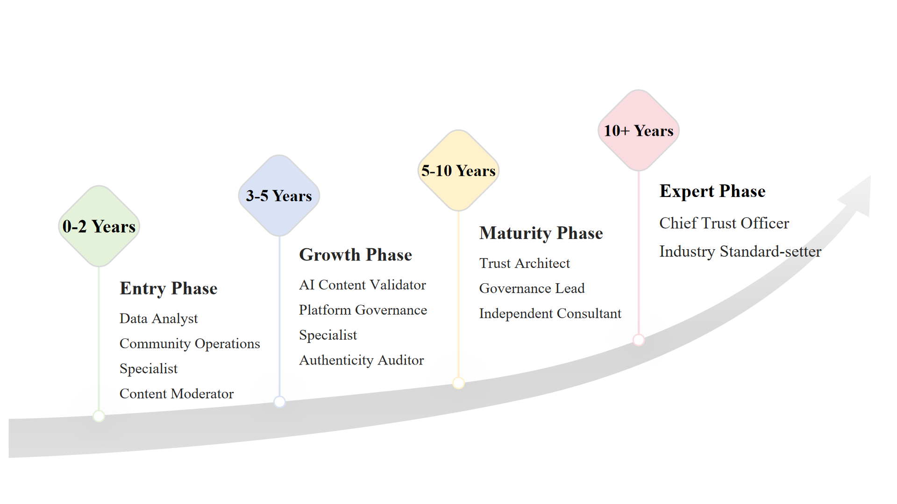

This route combines technical depth with a gradual expansion into policy, operations, and business. The exact order depends on the role. Early work can focus on one area, while later responsibility often requires coordination across several teams.

#### 5.1.2 Comparison of Enterprise Types

Different enterprise types offer distinct learning environments. UGC platforms provide direct exposure to community rules and rating integrity; large technology companies offer mature engineering systems; professional publications emphasize editorial provenance; consulting and audit firms provide cross-industry governance experience.

Company choice should consider role scope, manager quality, access to real problems, learning support, compensation, and stability. The most valuable roles provide access to investigation, review, and rule improvement instead of limiting the employee to a closed operational queue.

#### 5.1.3 Job Substitution Risk Assessment

Automation exposure varies within each occupation. Routine queue handling, simple reporting, and standardized replies are easier to automate. Appeals, policy interpretation, causal analysis, incident response, and communication across teams require more human judgment. Career resilience is therefore better assessed by task composition than by job title.

A useful screening question is how often the work requires handling new abuse patterns, incomplete evidence, and policy conflicts. Frequent exposure to open-ended investigation usually creates more opportunities to accumulate judgment, responsibility, and transferable experience.

### 5.2 Essential Skills

#### 5.2.1 Skills for Platform Governance

The following model groups the capabilities exercised by the case across four layers: disciplinary foundations, identification and verification, institutional design, and strategic communication.

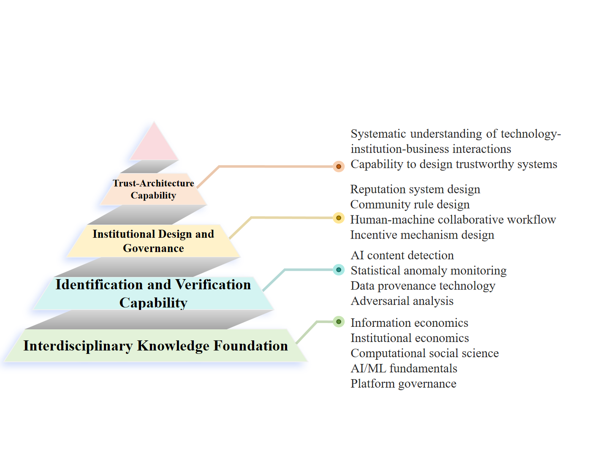

The foundation includes information economics, institutional analysis, computational social science, machine learning, and platform governance. These areas help practitioners examine incentives, rules, empirical patterns, automated systems, and moderation processes. The appropriate depth in each area depends on the role.

The second group covers verification: text classification, anomaly detection, data provenance, sampling, and abuse testing. Practitioners should understand detector errors and distinguish a statistical anomaly from evidence of manipulation. These tools need regular evaluation as data and models change.

The next group concerns institutional design and governance: reputation systems, community rules, human review of automated decisions, appeals, and contributor incentives. Some principles transfer across platforms, but their implementation depends on the product, user population, legal setting, and abuse patterns.

The fourth group covers strategy and communication. It includes tracing how a technical decision affects users and policy, anticipating abuse, balancing accuracy with privacy, explaining findings to different teams, and revising rules when evidence changes.

These skills improve through case work, review, and feedback. Their value is demonstrated by the ability to solve a problem, explain trade-offs, and leave an auditable record.

#### 5.2.2 Communication and Judgment Skills

Relevant professional skills include critical evaluation of automated output, ethical reasoning, cross-cultural analysis, clear communication, and conflict mediation. These skills are useful when evidence is incomplete, stakeholders disagree, or a technical metric does not resolve a policy decision.

These skills matter when a case involves competing interests, incomplete evidence, or an appeal. Automated tools can assist with factual checks, while accountable people still need to review policy and consequences.

## VI. Personal Career Planning and Job Search Strategies

### 6.1 Competitiveness Enhancement

#### 6.1.1 The Three-Year Competency Improvement Plan

The first year builds foundations in information economics, statistics, text analysis, and platform governance. A workable sequence is to write reading notes on Akerlof, Spence, and related research; reproduce a text-classification paper; observe governance in an open community; and publish a small project with clear data provenance and limitations.

The order can change with available courses and internships. Each activity should leave a concrete record: notes, code, an observation log, or a short report. That record makes progress easier to review and discuss in applications.

The second year can move from study to contribution. Possible activities include applying the institutional frameworks of North [3] and Ostrom [8] to a documented platform case, completing an adversarial machine-learning project, gaining supervised experience in platform governance, and developing a conference paper from a research question supported by appropriate data. The schedule should follow available opportunities and research readiness.

The second year should produce work that other people can inspect: an internship report, a reproduced study, a dataset note, or a paper. Claims should stay within the collected evidence. A small, careful study is more useful than a broad report with unsupported numbers.

The third year focuses on public work and applications. Useful steps include presenting a project, contributing to a governance or evaluation discussion, maintaining a technical blog, and applying for content integrity, platform governance, data quality, or AI evaluation roles.

By the third year, the goal is to have several pieces of work that can be reviewed by employers and peers. Projects, internships, writing, and presentations provide concrete evidence of ability.

#### 6.1.2 Internship and Project Selection

Trust and safety, content integrity, and community-governance teams provide direct experience with data-quality review, policy analysis, abuse investigation, evaluation design, and documentation. The value of an internship depends on whether it exposes the participant to problem definition, evidence review, and rule execution.

Trust and safety, content integrity, and algorithm-governance teams at larger technology companies offer experience with mature tools, large datasets, and cross-functional response. A useful placement connects anomaly discovery and metric design to review, policy explanation, and decision records.

Research institutions and think tanks build experience in research design, policy analysis, and public communication. Consulting and audit firms emphasize risk assessment, governance documentation, and the translation of findings into organizational action. The choice should follow the kind of evidence and responsibility the applicant wants to handle.

For personal projects, begin with the governance problem and then choose the technical method. A project might ask how a platform can assess the provenance and reliability of machine-assisted reviews without imposing real-name registration. The write-up should explain the evidence, implementation, results, failure modes, likely evasions, and nontechnical deployment constraints. These choices reveal more about a candidate's judgment than technical complexity alone.

#### 6.1.3 Professional Network Building

Professional relationships can develop through substantive participation in research and practitioner communities, contributions to open-source code or documentation, and careful communication with authors and peers. Public research notes should distinguish observation, interpretation, and evidence.

Professional networking works best when it is tied to useful work. Publishing careful analysis, contributing documentation, and asking informed questions give other people a concrete basis for judging your work.

### 6.2 Job Search Actions

#### 6.2.1 Target Company Selection

When selecting target organizations, translate the five platform types into a practical screening framework: what is being governed, how the data are produced, who owns review decisions, and how integrity metrics connect to business goals.

UGC platforms provide direct exposure to rating integrity, community rules, and moderation. Their strongest learning value lies in following a community signal through investigation, enforcement, appeal, and rule revision.

Large technology platforms offer mature engineering systems and specialized teams. Applicants should ask about team ownership, review processes, and role scope to distinguish queue execution from participation in governance design.

Professional publications offer experience with editorial provenance, commissioning, and criticism. Their distinctive value is close observation of how accountable judgment becomes brand trust.

Specialized AI-governance and generated-text-detection firms offer focused technical and evaluation work. Applicants should examine whether the organization sells an isolated score or helps clients build decisions that can be reviewed, appealed, and audited.

Consulting and audit firms offer cross-industry comparison and client communication. Roles with direct involvement in evidence collection, risk judgment, and remediation provide the strongest transferable experience.

When comparing offers, weigh learning, stability, compensation, role scope, and the quality of supervision. The importance of each factor depends on the individual's current needs.

#### 6.2.2 Interview Preparation

Interviews for governance and integrity roles commonly assess technical analysis, problem framing, policy judgment, documentation, and communication. Preparation should use a small number of cases that connect those abilities in a single decision process.

A typical interview question is: if RYM receives one million suspicious automated ratings in a month, how should the platform respond? A strong plan would preserve evidence, estimate the affected releases and accounts, separate suspicious clusters from unaffected activity, and reduce the ranking weight of high-risk contributions while the incident is reviewed. Detection should combine timing, account history, rating dispersion, network patterns, and any associated text instead of treating prose as proof of authorship. The governance response should define review authority, an appeal path, disclosure of verified facts, and criteria for restoring normal weighting. Recovery metrics should cover chart stability, false positives, appeal reversals, contributor retention, and renewed manipulation attempts.

Follow-up questions will test whether the candidate can decompose an ambiguous event into actionable tasks, embed technical measures in rules and review processes, anticipate an attacker's response, control false positives, and define recovery metrics. A strong answer demonstrates governance readiness as well as analytical fluency.

#### 6.2.3 Job Application Materials

The resume can cover governance or moderation experience, technical work in statistics or NLP, and published analysis. Each claim should name the dataset and evaluation design. For this project, an accurate description would say that the classifier was tested on a 30-example controlled corpus and has no external validation; it should not claim a finding about RYM reviews.

The cover letter should use a specific, truthful example from study, work, or a documented project. It can explain how the problem was investigated, what remained uncertain, and why the target team's work is relevant. Do not invent an encounter with AI reviews or imply access to platform data that was never collected.

The portfolio should show how a question developed across several pieces of work. For each project, include the source material, method, result, limitation, and next step. This gives reviewers enough detail to assess the quality of the work.

### 6.3 Personal Positioning and Development

#### 6.3.1 The Three Stages of Long-Term Development

Stage one (years 1 to 3) focuses on analysis and evaluation. Suitable roles include data analyst, content integrity analyst, and junior data scientist. A useful milestone is completing an end-to-end project with documented data, evaluation, and error analysis.

Stage two (years 3 to 7) adds responsibility for platform rules and operations. A platform governance lead may coordinate product, policy, engineering, and community teams and may lead work on reputation or appeals systems. Progress should be judged by actual responsibility and outcomes, since fixed year ranges do not fit every organization.

Stage three (years 7 to 15) may include governance leadership, standards work, policy, or independent consulting. A relevant milestone is contributing to a documented industry standard, audit method, or regulatory process.

#### 6.3.2 Path Selection

One path is to develop governance expertise within an established organization, gaining depth in product, policy, and operations. Another is to join or create a specialized service that provides audit, evaluation, and institutional design across clients. The first builds organizational depth; the second builds cross-context judgment.

The choice between these paths depends on risk tolerance, financial needs, and interest in the work. A role with transferable analysis and governance skills leaves more options open if the field changes.

## VII. Career Development Risks and Responses

### 7.1 Risk Identification

#### 7.1.1 Industry-Level Risks

New language models continually change the operating boundary of text detectors. Organizations should maintain dated external samples and compare performance, failure modes, and appeal outcomes over time rather than rely on a single detector or a one-time accuracy estimate.

Automated ranking and moderation systems will reduce some routine review and reporting tasks while increasing the importance of evaluation, appeals, policy interpretation, and data quality. Practitioners should move toward work that determines when automation fails and how consequential decisions are reviewed.

Further market concentration would place pressure on roles at independent evaluation platforms. Skills in evaluation, policy, data quality, and communication remain transferable to streaming, marketplaces, social platforms, research, and audit.

Policy changes alter documentation, labeling, and moderation responsibilities. Organizations need a recurring process that tracks relevant jurisdictions, maintains an obligation register, translates legal interpretation into product and operational controls, and retains auditable records.

#### 7.1.2 Individual-Level Risks

A narrow dependence on one detector or model can become a risk when tools change. Review skills periodically and keep experience in statistics, evaluation, policy, and communication alongside tool-specific knowledge.

Job titles vary across companies. Similar work may appear under trust and safety, content integrity, platform governance, data quality, policy operations, or AI evaluation. Applicants should search by responsibilities and show evidence of relevant work.

Organizational scale does not remove the risk of role contraction, restructuring, or technology replacement. Transferable skills, public work, and professional relationships reduce dependence on one organization or technology stack.

Commercial metrics can conflict with content-integrity goals. Practitioners should document risks, identify affected users, compare short-term growth with longer-term trust costs, and use formal escalation channels. Linking integrity to retention, appeals, chart use, and brand damage brings governance into operating decisions.

### 7.2 Response Strategies

#### 7.2.1 Improving Career Adaptability

A practical allocation is to keep most time on work that compounds through repeated use, while reserving a smaller fixed block for research, writing, or an independent project. The exact ratio should follow workload and finances. One adjacent skill, such as network analysis or data visualization, is enough when it produces finished work and does not become another unfinished curriculum.

Professional reputation, working relationships, institutional knowledge, and a documented case record can support later work. Their value is context-dependent and may change with technologies and organizations. Regular publication and reflection make those capabilities easier for collaborators and employers to assess.

Researchers and practitioners may need to connect several levels of analysis. Technical questions include detector error rates; institutional questions concern rules, appeals, and user responses; organizational questions concern resources and accountability. Moving among these levels can reveal assumptions that remain hidden in a single technical or strategic analysis.

#### 7.2.2 Crisis Response

When a platform detects a large volume of suspicious contributions, it should enter a documented incident process: preserve evidence, estimate scope, isolate high-risk effects, protect unaffected users, review automated decisions, communicate verified facts, and monitor recovery. Response timing should follow event severity and platform capacity.

When external evaluation shows that a detector is losing accuracy, review data drift, failure modes, and the role of human appeal before recalibrating, combining, or replacing tools. Career judgment follows a similar sequence: determine whether the role still creates value before deciding to strengthen skills, change positions, or move into an adjacent field.

When an organization changes its governance strategy, practitioners should assess whether responsibility remains clear, ethical boundaries remain defensible, and the work can still improve real outcomes. Budget, authority, review procedures, and performance metrics reveal more than a product announcement.

When regulation changes, governance practitioners can work with legal, policy, technical, and user-protection specialists to translate abstract requirements into product fields, operational actions, responsibility assignments, and audit records.

When opportunities narrow in one platform category, describe experience through transferable responsibilities such as data quality, moderation, evaluation, policy, and incident response, and test adjacent directions early. Several viable points of entry provide greater resilience than dependence on a single platform category.

#### 7.2.3 Learning Strategies

A useful learning plan combines structured study with problem-led practice. Core methods should be reviewed as tools and research standards change. Papers, books, code, documentation, and practitioner discussions serve different purposes and should be evaluated according to their evidential value.

Possible resources include peer-reviewed work from CSCW, CHI, FAccT, and related venues; preprints on text provenance and platform governance; technical documentation; and practitioner publications. A sustainable schedule might combine close reading with replication, a small empirical exercise, or a critical research note. Frequency should follow available time and the quality of the selected material.

# Part 3 Summary

## VIII. Conclusions and Recommendations

### 8.1 Conclusions

Conclusion 1: generative AI creates a structural governance pressure on crowdsourced evaluation by reducing the cost of producing review-like text and weakening production effort as an implicit provenance signal. Platform governance must therefore address contribution history, rating weight, legitimate-contributor protection, and confidence in accumulated data alongside content quality. This shift from content scarcity to provenance scarcity is the study's central theoretical contribution.

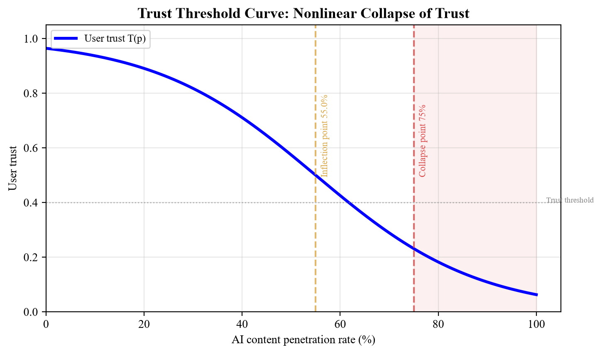

Conclusion 2: the selected RYM and AOTY archives contain a strongly aligned cross-platform evaluative order. Across 4,102 exact album matches, user scores correlate at 0.910 and 87.4% differ by no more than half a point on a common 0-5 scale. This is the clearest empirical result in the study. It shows that two distinct communities have produced comparable judgments across a large shared catalog, making the credibility of score production and weighting an asset in its own right.

Conclusion 3: attention and written participation are unevenly distributed within the selected archives. The AOTY high-rated snapshot has a rating-count Gini coefficient of 0.617, while the RYM popular snapshot has a coefficient of 0.400; the top 1% account for 12.3% and 6.8% of represented ratings, respectively. Within the RYM snapshot, the median written-review share is 1.65%. Ratings are abundant, but the written layer that interprets, contextualizes, and classifies releases is comparatively thin. Core-contributor retention therefore belongs at the center of both governance and community management.

Conclusion 4: textual features can support risk triage, but they cannot carry authorship decisions alone. Five-fold out-of-fold evaluation on 15 published critic excerpts and 15 manually authored assistant-style controls produced 96.7% accuracy and an AUC of 0.996. The benchmark verifies the feature-extraction and evaluation workflow. Production use requires platform-native human reviews, documented outputs from multiple models and prompts, unseen artists, behavioral evidence, and external validation.

Conclusion 5: the structural-break workflow is implemented and validated against a known synthetic break. The Chow, CUSUM, and Bai-Perron-style procedures recover the designed change near November 2022, establishing that the pipeline can detect a prespecified discontinuity under controlled conditions. Replacing the synthetic input with dated repeated snapshots would turn this method check into a test of changes in rating distributions, review depth, contributor activity, and trust.

Conclusion 6: ranking design and provenance policy are active components of platform governance. AOTY moved genre, critic, and user charts toward weighted scores and added user-level CSV export between October 2025 and July 2026. The platform's changelog does not attribute these changes to AI, but it confirms that count thresholds, weighting, and portability are product choices rather than fixed properties of the data. Platform advantage will increasingly depend on the credibility of contribution histories and governance records alongside the scale of accumulated data.

The conclusions operate at three evidence levels. Cross-platform agreement, attention concentration, and review participation are observed within selected archives. The text comparison and structural-break analyses validate methods under controlled conditions. Trust curves, policy effects, and competitive scores are scenario models. The study does not infer a post-2022 causal break from cross-sectional archives, and it does not treat scenario parameters as measured platform behavior.

### 8.2 Industry Strategic Recommendations

Platforms should treat trust as a product function with named owners, measurable indicators, and release criteria. Rating charts need visible weighting rules, contribution histories, anomaly monitoring, appeal paths, and change logs. Data exports should carry field definitions and provenance notes. These measures increase the auditability and reuse value of accumulated data without requiring perfect proof of human authorship.

The first operational priority is contribution integrity. Combine account age, rate limits, timing patterns, rating dispersion, review history, and coordinated-behavior signals; publish what affects weighting; give users a path to challenge enforcement. Linguistic detection can inform triage and should not decide authorship by itself. The archive results support this emphasis because a small written-review layer sits above millions of ratings, making false positives against serious contributors costly.

Platforms should evaluate a minimum provenance vocabulary covering account-age bands, edit history, moderation status, source type, rating-weight policy, and machine-assistance disclosure. C2PA offers useful principles for signed provenance, while short-text governance still requires account history, behavioral evidence, privacy review, and human judgment. A pilot should measure comprehension, adoption, false-positive costs, and appeal outcomes before broader deployment.

Platform governance should begin before a moderation incident. Waiting periods, graduated rating weight, burst controls, transparent minimum-count rules, and review queues can reduce damage before removal is required. Community rules should distinguish disclosed assistance, undisclosed generated reviews, coordinated rating campaigns, and ordinary disagreement. The policy needs proportional sanctions and an appeal record that can be audited.

### 8.3 Recommendations for Practitioners

Build working knowledge across technology, platform rules, incentives, and business constraints. Course and project choices should connect these areas to a concrete governance problem and produce evidence that can be inspected by others.

Develop depth in one technical field, such as NLP, text analysis, or recommendation systems, sufficient to complete an end-to-end project. Combine that depth with institutional economics, platform governance, and data ethics. This combination supports both technical implementation and judgment about how model outputs enter rules, appeals, and accountable decisions.

Use projects to show problem framing, evidence handling, implementation, and trade-offs. Include abuse cases and explain how the design could fail.

Publish work that documents sources, evaluation choices, errors, and revisions, and participate in relevant technical, policy, or research communities. A sustained record of inspectable work gives employers and collaborators direct evidence of judgment and communication.

# Part 4 Appendices

## Appendix A Detailed Tables of Research Data and Statistical Analysis

### A.1 Observed Archive Statistics

| Statistic | AOTY archive/snapshot | RYM snapshot | Cross-platform | Interpretation |
| --- | --- | --- | --- | --- |
| Album records | 32,358 historical + 5,000 high-rated | 5,000 popular | 4,102 exact matches | Selected cross-sections |
| Ratings represented in top-5,000 file | 6,277,268 | 30,418,504 | - | Sample totals; not platform totals |
| Median ratings per album | 482 | 3,973 | - | Selection rules differ |
| Top 1% share of represented ratings | 12.29% | 6.80% | - | Within-sample concentration |
| Rating-count Gini coefficient | 0.617 | 0.400 | - | Within-sample inequality |
| Median written-review share | Not available | 1.65% | - | Reviews divided by ratings |
| User-score agreement | - | - | Pearson r = 0.910; Spearman rho = 0.836 | Exact artist-title-year matches |
| Score calibration | - | - | 87.4% within 0.5; median AOTY-RYM = +0.34 | Both scores rescaled to 0-5 |

### A.2 Synthetic Structural-Break Method Check

| Test method | Recovered breakpoint | Benchmark interpretation | Statistic | Inference status |
| --- | --- | --- | --- | --- |
| Bai-Perron-style segmentation | November 2022 | Recovers the designed change window | Least-squares/BIC result | Synthetic benchmark only |
| Descriptive CUSUM | December 2022 | Falls close to the designed change | Detrended residual path | Permutation bootstrap on synthetic input |
| Regression Chow test (split at 2022.11) | November 2022 | Tests the prespecified designed split | Split-versus-pooled regression F | Synthetic benchmark only |

### A.3 Controlled Text-Classification Performance

| Component | N | Source | Evaluation | Main result | Boundary |
| --- | --- | --- | --- | --- | --- |
| TF-IDF + Random Forest | 30 | Combined corpus | 5-fold out-of-fold | Accuracy 96.7%; AUC 0.996 | Distinguishes the two constructed groups; no external validation |
| Critic excerpts | 15 | Published critic excerpts in AOTY/Metacritic archive | Deterministic source-diverse sample | Observed text | Professional critics; no platform-user sample |
| Assistant-style controls | 15 | Manually authored controls | Fixed benchmark | Controlled text | Not generated by a documented model; no prompt diversity |
| Intended use | - | - | Feature and pipeline check | Demonstration only | No prevalence estimate |

### A.4 Linguistic Features in the Controlled Corpus

| Rank | Feature | Critic-excerpt mean | Assistant-style control mean | Standardized difference | Direction |
| --- | --- | --- | --- | --- | --- |
| 1 | Average sentence length | 22.778 | 12.922 | -1.26 | Higher in critic excerpts |
| 2 | Vocabulary diversity | 0.900 | 0.869 | -0.69 | Higher in critic excerpts |
| 3 | Filler-word count | 0.133 | 0.000 | -0.54 | Higher in critic excerpts |
| 4 | Emotional-word count | 0.000 | 0.133 | +0.54 | Higher in assistant-style controls |
| 5 | All-caps ratio | 0.001 | 0.000 | -0.37 | Higher in critic excerpts |
| 6 | Technical-term count | 0.133 | 0.267 | +0.33 | Higher in assistant-style controls |
| 7 | Contrastive-word count | 0.333 | 0.200 | -0.25 | Higher in critic excerpts |
| 8 | Number-reference count | 0.333 | 0.200 | -0.18 | Higher in critic excerpts |
| 9 | Sentence-length SD | 4.124 | 4.152 | +0.01 | Similar |
| 10 | First-person count | 0.000 | 0.000 | 0.00 | No difference in sample |
| 11 | Specific-reference count | 0.000 | 0.000 | 0.00 | Dictionary did not capture archive details |

### A.5 Assumed Trust Model Parameters

| Parameter | Meaning | Baseline value | Sensitivity range |
| --- | --- | --- | --- |
| α (alpha) | Preference intensity parameter | 0.7 | [0.4-0.9] |
| β (beta) | User discrimination ability | 2.0 | [0.5-5.0] |
| γ (gamma) | Network effect strength | 0.3 | [0.0-0.8] |
| τ (tau) | Trust threshold | 0.4 | [0.2-0.6] |

### A.6 Assumption-Driven User-Group Scenarios

| User type | Discrimination β | Preference α | Trust reference τ | Scenario crossing point | Assumed share |
| --- | --- | --- | --- | --- | --- |
| Veteran music fans (core contributors) | 4.0 | 0.85 | 0.55 | 30% | 5-10% |
| Active users (regular rating) | 2.5 | 0.75 | 0.50 | 45% | 20-30% |
| Ordinary users (occasional rating) | 1.2 | 0.65 | 0.45 | 62% | 40-50% |
| Casual browsers (rare participation) | 0.6 | 0.55 | 0.35 | 80% | 15-25% |

### A.7 Analyst-Coded Competitive Scenario Scores

| Platform | Data depth | Social experience | Technology barrier | Data barrier | Community barrier | AI risk | Composite vulnerability |
| --- | --- | --- | --- | --- | --- | --- | --- |
| RYM | 9.5 | 7.0 | 6.0 | 9.5 | 8.5 | 9.0 | 8.14 |
| AOTY | 7.0 | 8.5 | 5.5 | 7.0 | 8.0 | 8.5 | 7.57 |
| Pitchfork | 5.0 | 3.0 | 3.0 | 4.0 | 7.0 | 6.5 | 5.36 |
| Discogs | 9.0 | 5.0 | 5.0 | 9.0 | 7.0 | 5.0 | 5.07 |
| Bandcamp | 6.0 | 6.5 | 4.0 | 5.0 | 6.0 | 4.0 | 4.57 |
| Spotify | 3.0 | 4.0 | 8.0 | 6.0 | 3.0 | 4.0 | 3.86 |
| Apple Music | 3.0 | 3.0 | 7.0 | 5.0 | 2.0 | 3.5 | 3.36 |
| Douban Music | 6.5 | 7.0 | 3.0 | 6.5 | 7.0 | 8.0 | 5.60 |
| Last.fm | 8.0 | 5.0 | 4.0 | 8.0 | 5.0 | 6.0 | 5.50 |

## Appendix B Proposed Community-Discussion Coding Scheme

The RYM forum file in this repository is synthetic. Its titles, topic labels, dates, and yearly counts were generated from templates. They cannot be described as forum archives or used to estimate changes in community attention. This appendix records the intended coding scheme for future collection: topic, date, reply count, sentiment, and moderation response.

No empirical sequence of community attitudes can be reported from the current file. A later analysis should publish the forum query, sampling dates, inclusion rules, deduplication procedure, and a reproducible annotation codebook before presenting sentiment percentages.

## Appendix C Methodology and Technical Route

The research design follows the proposed shift from content scarcity to provenance scarcity and the technology-institution-organization-value transmission framework. It combines descriptive archive analysis, a controlled text-classification exercise, synthetic method checks, and deterministic scenarios. The implemented methods are exact cross-platform entity matching, concentration statistics, observed genre profiles, Bai-Perron-style least-squares segmentation [6], descriptive CUSUM with bootstrap inference, a regression Chow test at a prespecified split [7], five-fold out-of-fold TF-IDF classification, and trust scenarios with sensitivity analysis. Only the archive analysis provides empirical platform evidence. Structural-break procedures use a synthetic benchmark because repeated rating timestamps are unavailable.

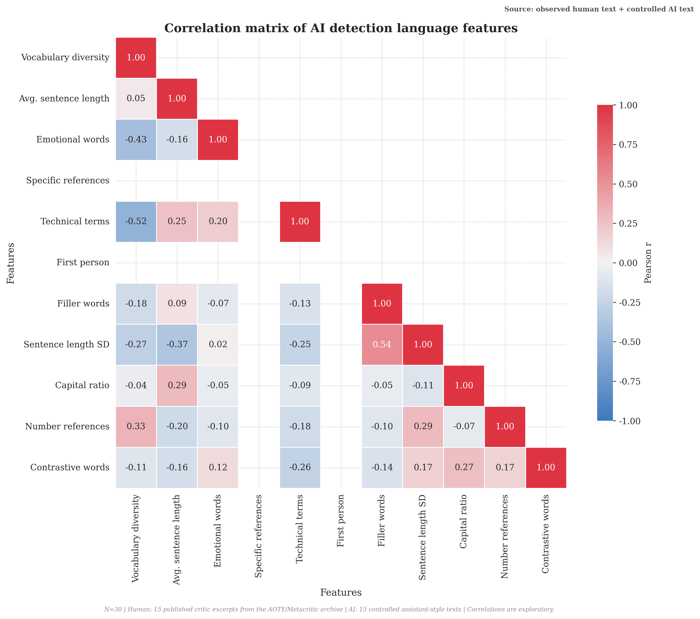

Repository inputs include 42,358 observed album rows across three third-party archives, 116,384 published critic excerpts in the training archive, 4,102 deduplicated cross-platform matches, 17,274 legacy synthetic rows, and eight collection-event audit rows at the latest check. The source manifest records URLs, dates, licenses, limitations, and archive checksums. Live RYM and AOTY requests remain blocked or challenged, so no failed request is converted into an observation.

Data limitations: the observed files are selected cross-sections assembled by third parties. They do not reveal when individual ratings were submitted, and the RYM publisher states no license. The forum titles and all five legacy raw files remain synthetic and excluded. The classifier has no platform-user holdout, while trust and competition parameters remain analyst assumptions. Empirical figures support descriptive baselines; scenario figures support conditional reasoning only.

## Appendix D References

[1] Akerlof, G. A. (1970). The Market for 'Lemons': Quality Uncertainty and the Market Mechanism. Quarterly Journal of Economics, 84(3), 488-500.

[2] Spence, M. (1973). Job Market Signaling. Quarterly Journal of Economics, 87(3), 355-374.

[3] North, D. C. (1990). Institutions, Institutional Change and Economic Performance. Cambridge University Press.

[4] Luhmann, N. (1979). Trust and Power. Wiley.

[5] Granovetter, M. (1978). Threshold Models of Collective Behavior. American Journal of Sociology, 83(6), 1420-1443.

[6] Bai, J., & Perron, P. (1998). Estimating and Testing Linear Models with Multiple Structural Changes. Econometrica, 66(1), 47-78.

[7] Chow, G. C. (1960). Tests of Equality Between Sets of Coefficients in Two Linear Regressions. Econometrica, 28(3), 591-605.

[8] Ostrom, E. (1990). Governing the Commons: The Evolution of Institutions for Collective Action. Cambridge University Press.

[9] Gillespie, T. (2018). Custodians of the Internet: Platforms, Content Moderation, and the Hidden Decisions That Shape Social Media. Yale University Press.

[10] Vaswani, A., et al. (2017). Attention Is All You Need. NeurIPS 2017.

[11] Bommasani, R., et al. (2022). On the Opportunities and Risks of Foundation Models. Stanford CRFM.

[12] Epstein, Z., et al. (2023). Art and the Science of Generative AI. Science, 380(6650), 1110-1111.

[13] Mitchell, E., et al. (2023). DetectGPT: Zero-Shot Machine-Generated Text Detection using Probability Curvature. ICML 2023.

[14] Sadasivan, V. S., et al. (2023). Can AI-Generated Text be Reliably Detected? arXiv:2303.11156.

[15] IFPI. (2026). Global Music Report 2026.

[16] European Commission. (2024). The EU Artificial Intelligence Act.

[17] C2PA. (2024). Content Credentials: Technical Specification v2.0.

[18] Archived data sources: [Kauvin Lucas, AOTY/Metacritic ratings and reviews](https://www.kaggle.com/datasets/kauvinlucas/30000-albums-aggregated-review-ratings); [tabibyte, AOTY top 5,000](https://www.kaggle.com/datasets/tabibyte/aoty-5000-highest-user-rated-albums); [Bryan O., RYM top 5,000](https://www.kaggle.com/datasets/tobennao/rym-top-5000).

## Appendix E List of Figures and Tables

### I. Analysis Figures (Figure 1-Figure 12)

| Number | Figure title | Content description | Corresponding analysis technique |
| --- | --- | --- | --- |
| Figure 1 | AI Impact Timeline | Verified policy and AOTY product dates beside the observed evidence base | Documented timeline + archive counts |
| Figure 2 | Structural Breakpoint Analysis | Synthetic pre/post comparison, rolling statistics, and descriptive CUSUM | Chow + CUSUM + Bai-Perron-style segmentation |
| Figure 3 | Comparison of AI and Human Review Features | Original figure title; published critic excerpts compared with manually authored assistant-style controls | Standardized feature differences |
| Figure 4 | Comparison of Rating Distribution Evolution | Exact-match AOTY-RYM score agreement and calibration | Hexbin correlation + difference distribution |
| Figure 5 | Trust Threshold Model | Deterministic curves under selected assumptions | Logistic trust scenario + network parameter |
| Figure 6 | Parameter Sensitivity Analysis | alpha/beta/gamma sensitivity under selected values | Deterministic parameter sweep |
| Figure 7 | User-Heterogeneity Trust Thresholds | Heterogeneous trust curves of four types of users | Heterogeneous parameter simulation |
| Figure 8 | Four-Dimensional Impact Assessment of the AI Shock | Analyst-coded four-dimension scenario | Selected ordinal scores |
| Figure 9 | Comparison of Policy Intervention Effects | Comparison under assumed policy multipliers | Deterministic policy scenario |
| Figure 10 | Genre Impact Heatmap | Observed score, attention, review density, and coverage by shared genre | Standardized heatmap + archive counts |
| Figure 11 | Competitive Landscape Positioning Map | Equal-size points using analyst-coded positions | Selected data-depth and social-experience scores |
| Figure 12 | Feature Correlation Heatmap | Correlations in the critic-excerpt and manually authored control corpus | Descriptive feature analysis |

### II. Illustrative Figures (Figure A-Figure K)

| Number | Figure title | Purpose description |
| --- | --- | --- |
| Figure A | Music Information Service Value Chain | Show the niche of AOTY/RYM in the independent music industry chain |
| Figure B | Development History Timeline | Show the evolution context of the four stages from Web 1.0 to the generative AI shock |
| Figure C | Comparison of UGC Incentive Structures | Compare contributor incentives under two assumed conditions |
| Figure D | The Lemons-Market Mechanism of the Evaluation Market | Explain the mapping relationship of Akerlof's lemons market theory on UGC evaluation platforms |
| Figure E | Heterogeneous Trust Curves | Show the differentiated trust threshold curves of four types of user groups |
| Figure F | The Four-Fold Institutional Logic of the AI Shock | Organize the scenario across technology, rules, organization, and value |
| Figure G | Platform Strategic Response Matrix | Show the two-dimensional matrix of the four strategies of defense/offense/institution/ecosystem |
| Figure H | Revaluation of Data Asset Value | Show the four-fold effects of data assets under the AI shock |
| Figure I | Career Development Route in the Trust Economy | Illustrate one possible route from analysis to governance leadership |
| Figure J | Trust Literacy Competency Model | Group useful technical, policy, and communication skills |
| Figure K | Trust Threshold Curve | Illustrate a nonlinear curve under selected parameters |

## Data Ethics Statement

The collectors use rate limits, identify blocked or challenged responses, and record collection events without converting them into observations. Current live attempts produced no verified platform rows. No personally identifiable information is intentionally collected or analyzed. Every synthetic row now carries explicit provenance fields. Any future collection should be checked against the applicable terms, robots guidance, privacy requirements, and research-ethics rules before use.
